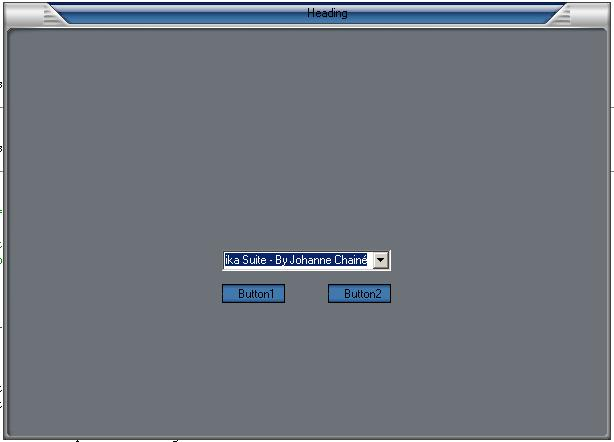



## Skinable Form \(2nd Release\)

### Description

This is an Update of my Skinable form. This version allows you to load/Save the location of everything on the form form a textfile, it even hold values to textboxes, captions, checkboxes, option Buttons. It also Comes With 10 More skins to choose from. Please Post Comments and Vote if you think its needed!!
 
### More Info
 

             |
---                |---
**Submitted On**   |2000-01-16 20:54:20
**By**             |[�e7eN](https://github.com/Planet-Source-Code/PSCIndex/blob/master/ByAuthor/e7en.md)
**Level**          |Beginner
**User Rating**    |4.1 (37 globes from 9 users)
**Compatibility**  |VB 6\.0
**Category**       |[Miscellaneous](https://github.com/Planet-Source-Code/PSCIndex/blob/master/ByCategory/miscellaneous__1-1.md)
**World**          |[Visual Basic](https://github.com/Planet-Source-Code/PSCIndex/blob/master/ByWorld/visual-basic.md)
**Archive File**   |[Skinable\_F511131252002\.zip](https://github.com/Planet-Source-Code/e7en-skinable-form-2nd-release__1-31022/archive/master.zip)

